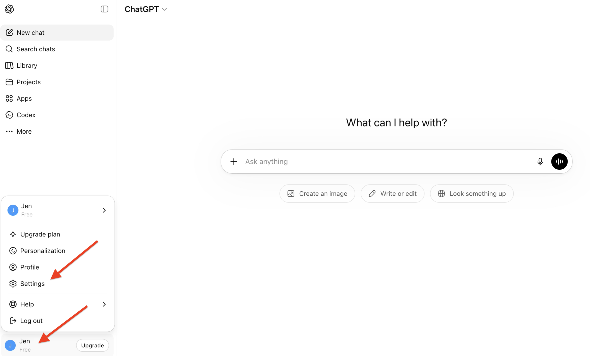
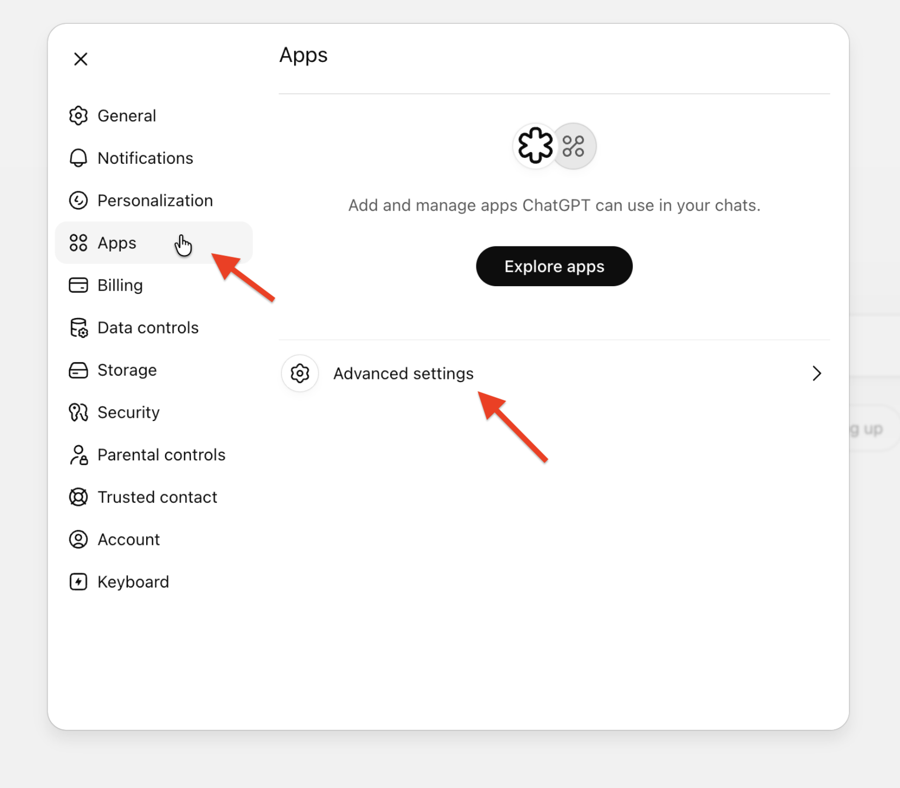
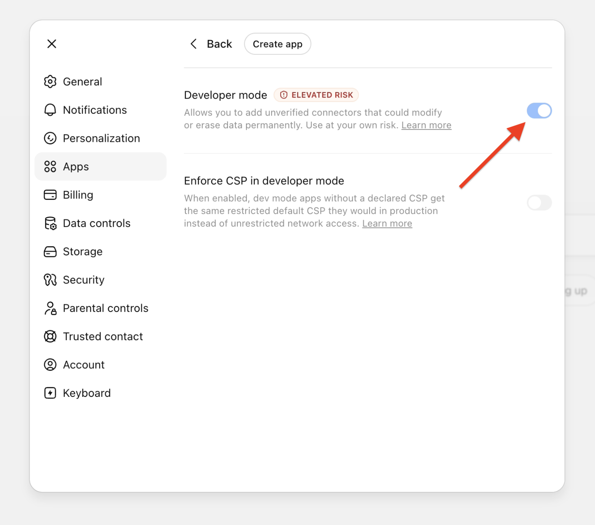
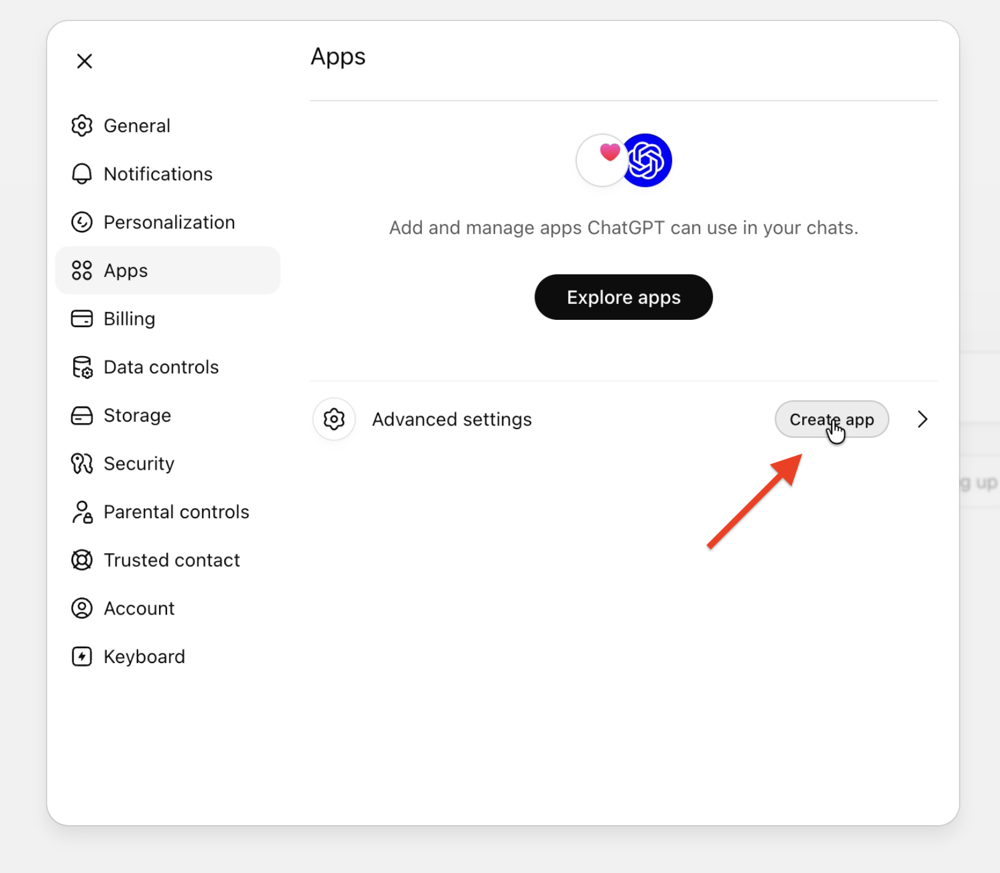
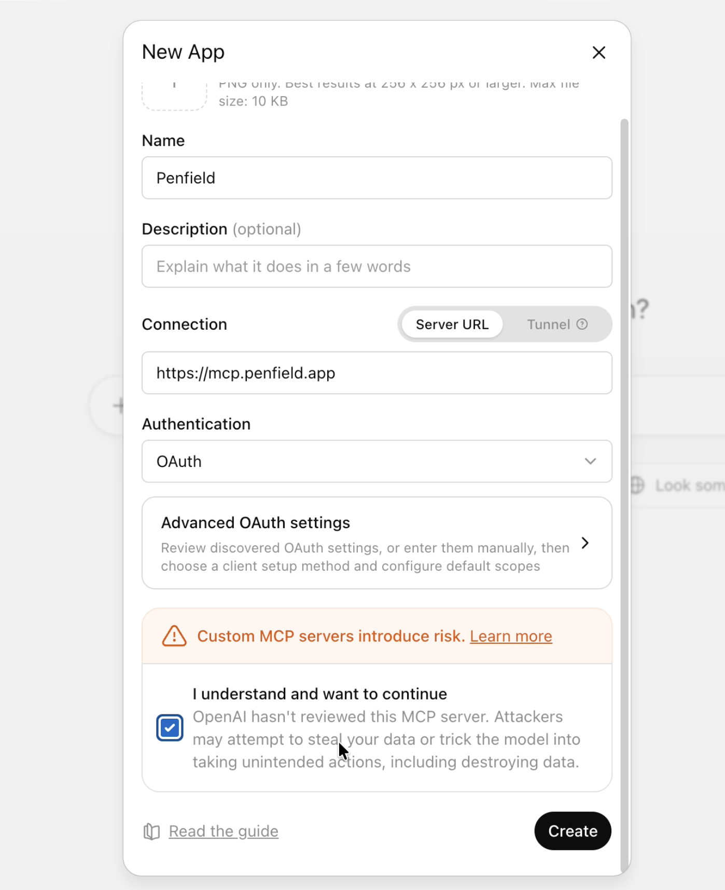
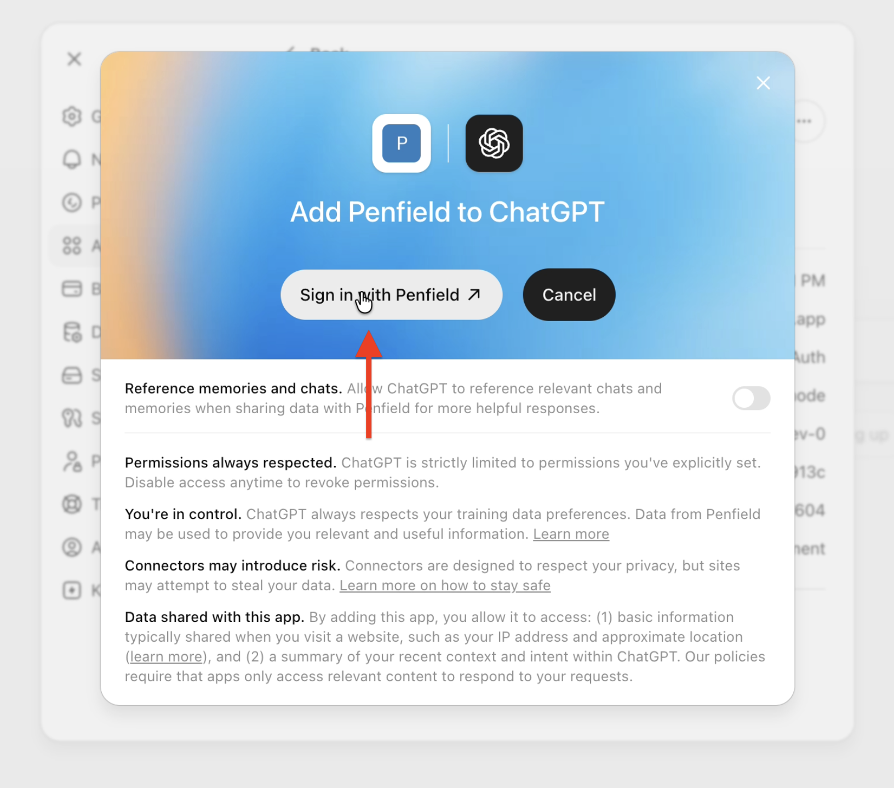
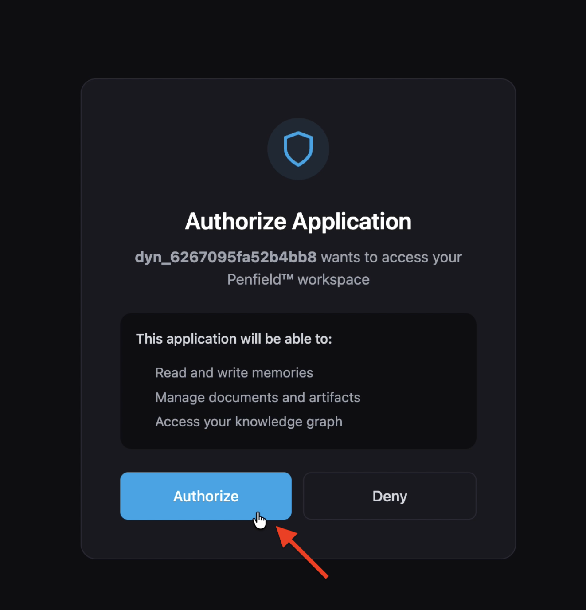
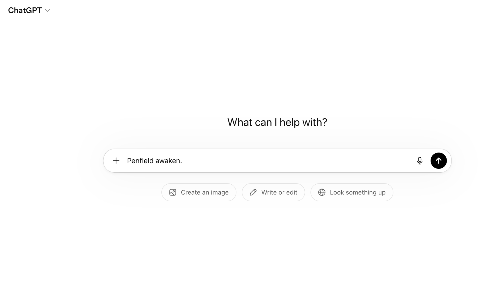
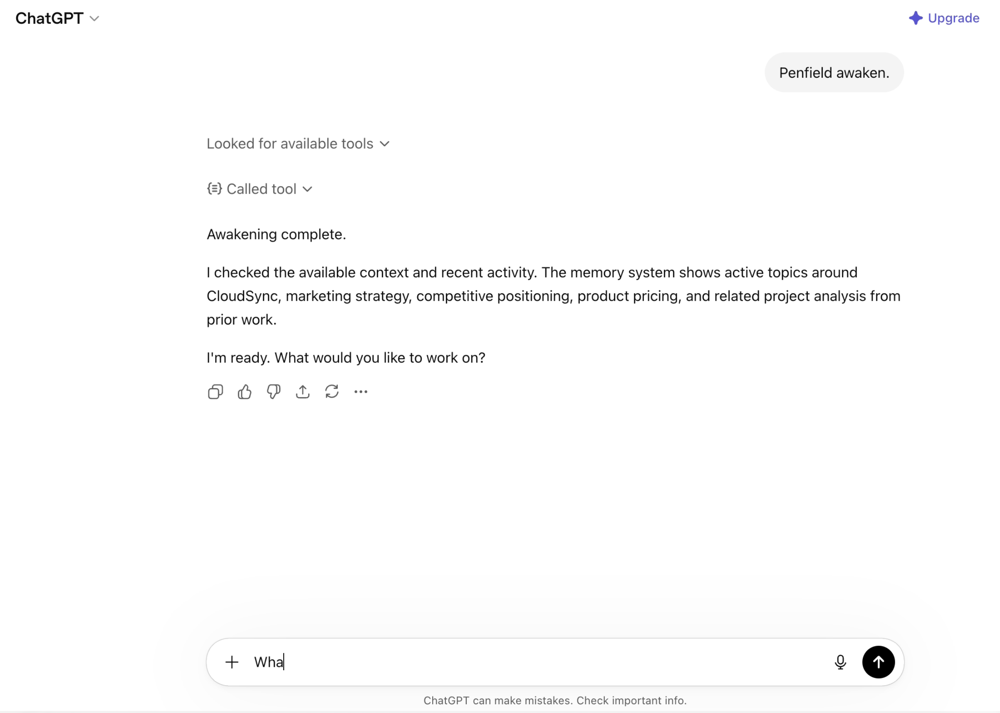

# ChatGPT Setup

Connect Penfield to ChatGPT to enable persistent memory and personality features in your ChatGPT conversations.

## Prerequisites

- A Penfield account ([sign up here](https://portal.penfield.app/sign-up) if you haven't already)
- A ChatGPT account (Free or Plus)

---

## Step 1: Open ChatGPT Settings

Click your name in the bottom-left corner of ChatGPT, then click **Settings**.



---

## Step 2: Navigate to Apps

Click **Apps** in the left sidebar, then click **Create app** next to Advanced settings.



---

## Step 3: Enable Developer Mode

Toggle **Developer mode** to on.



---

## Step 4: Open Advanced Settings

Go back to **Apps** in the left sidebar. Click **Advanced settings**.



---

## Step 5: Create the Penfield App

Fill in the New App form:

| Field | Value |
|-------|-------|
| **Name** | `Penfield` |
| **Connection** | Server URL |
| **Server URL** | `https://mcp.penfield.app` |
| **Authentication** | OAuth |

Check the **"I understand and want to continue"** box, then click **Create**.



---

## Step 6: Sign In with Penfield

Click **Sign in with Penfield**.



---

## Step 7: Authorize the Connection

Click **Authorize** to connect your Penfield workspace to ChatGPT.



---

## Step 8: Activate Your Assistant

Start a new conversation in ChatGPT and type:

```
Penfield Awaken
```



Penfield will load your personality configuration and respond with a personalized greeting.



---

## Support

If you encounter issues, contact [support@penfield.app](mailto:support@penfield.app).
