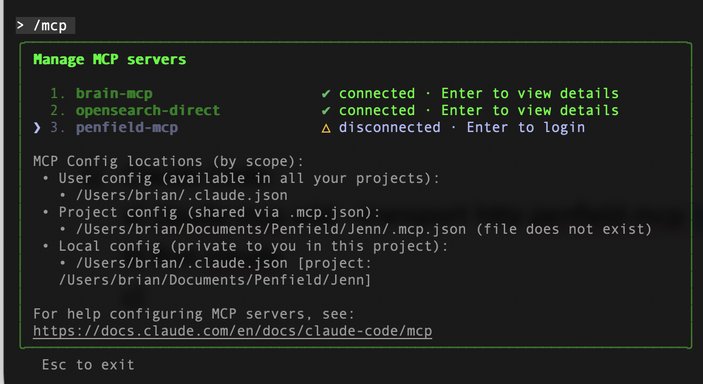
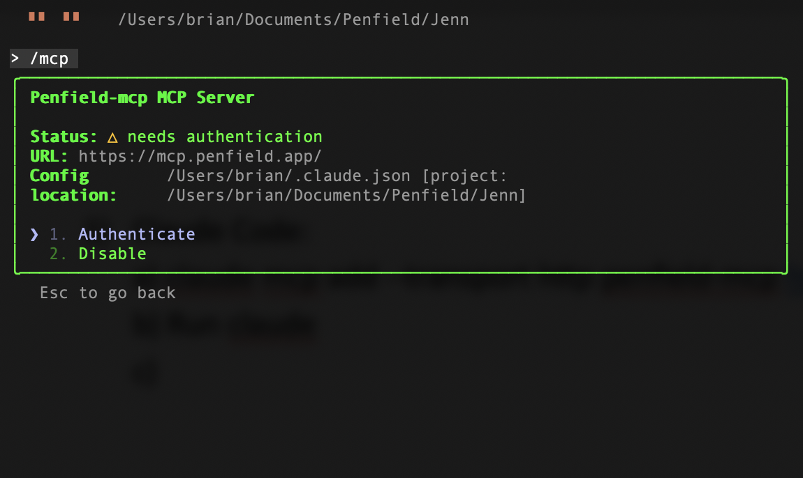
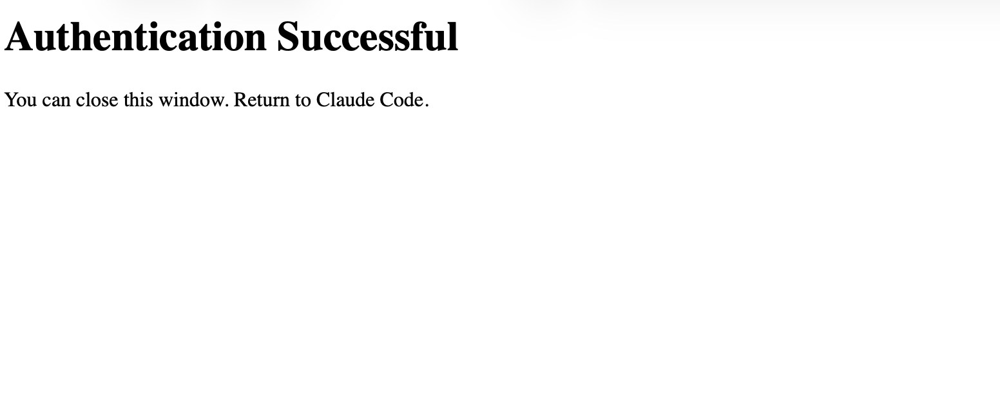

# Setting Up Penfield with Claude Code

Connect Penfield to Claude Code to enable persistent memory and personality features in your terminal-based Claude sessions.

---

## Step 1: Add the Penfield MCP Server

Run the following command in your terminal:

```bash
claude mcp add --transport http --scope user penfield https://mcp.penfield.app
```

---

## Step 2: Launch Claude Code

Start Claude Code:

```bash
claude
```

---

## Step 3: Open MCP Settings

Run the `/mcp` command to view your MCP servers:

```
/mcp
```



---

## Step 4: Authenticate Penfield

1. Select **penfield-mcp** from the list
2. Select **Authenticate**



3. A browser window will open. Complete the authorization in your browser.



4. Return to Claude Code

---

## Verification

After authentication, Penfield tools will be available in your Claude Code sessions. Start a new session and type "Awaken" to test the connection.

---

## Still Having Issues?

Contact [support@penfield.app](mailto:support@penfield.app) for assistance.
