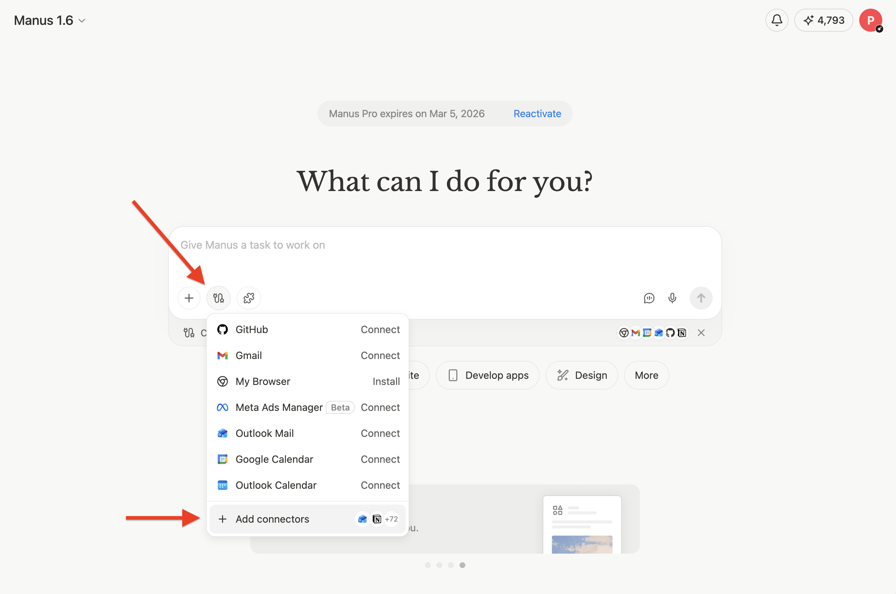
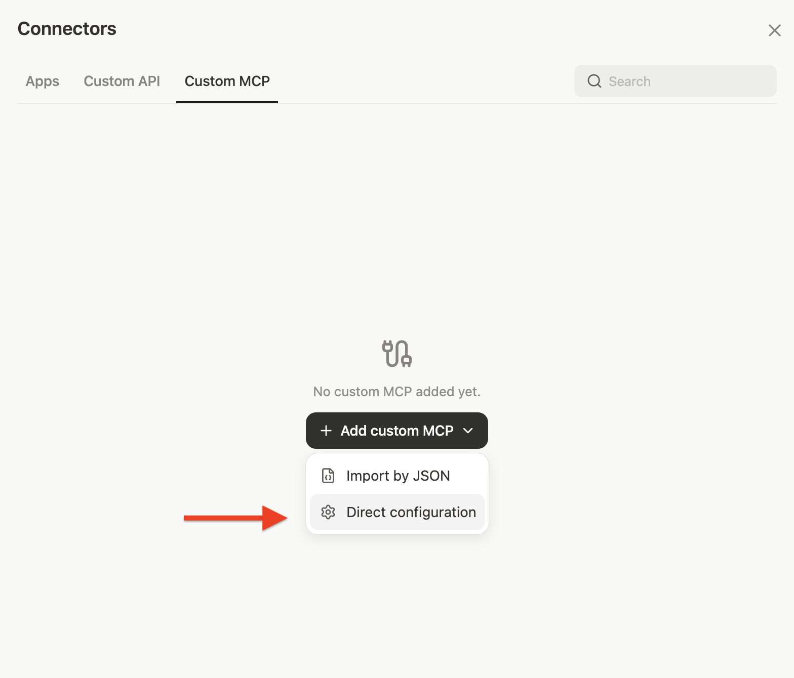
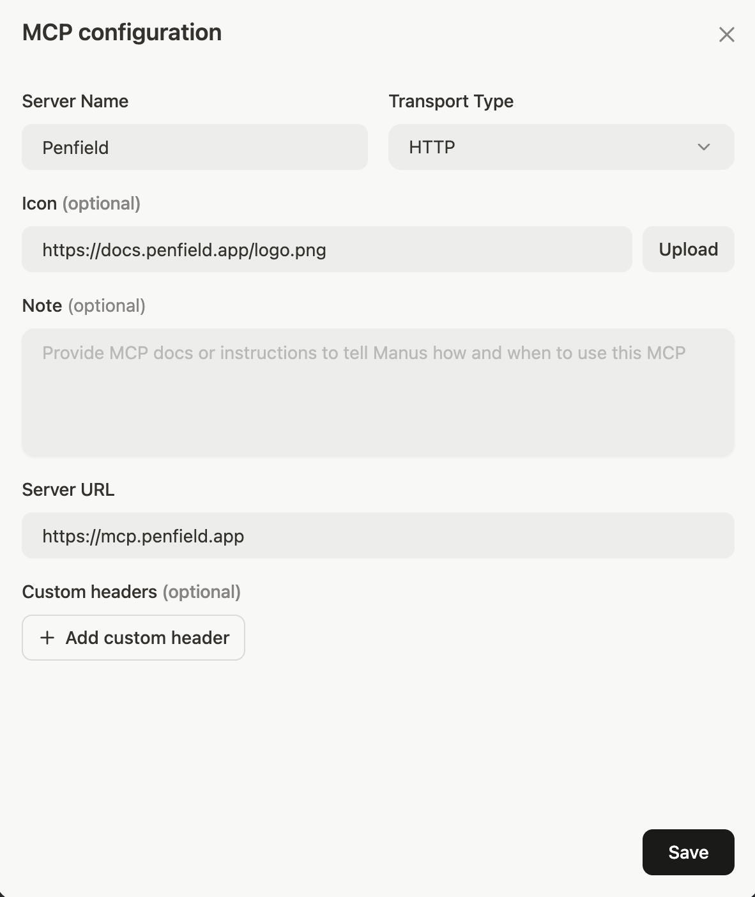
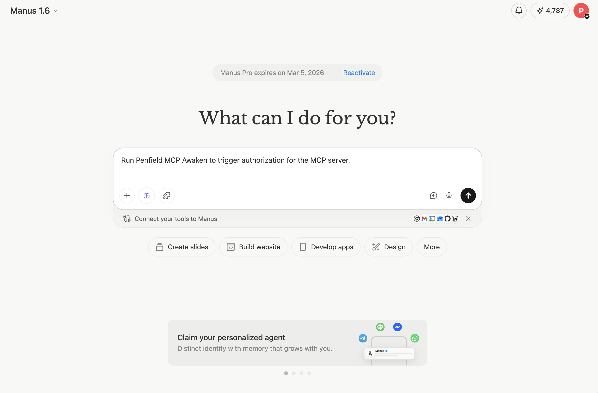
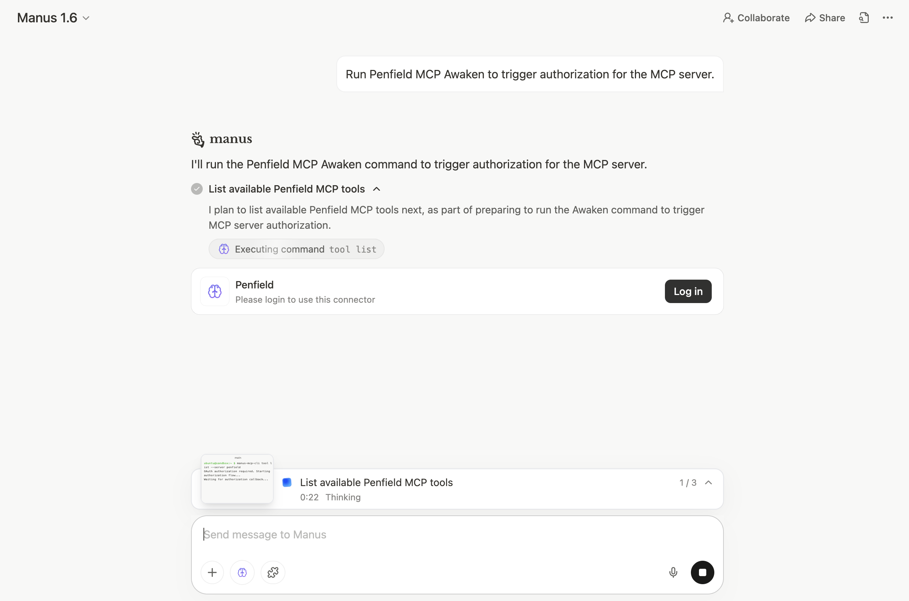
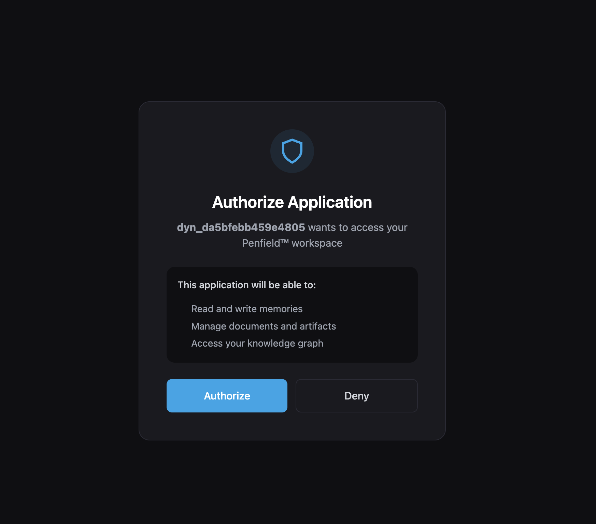
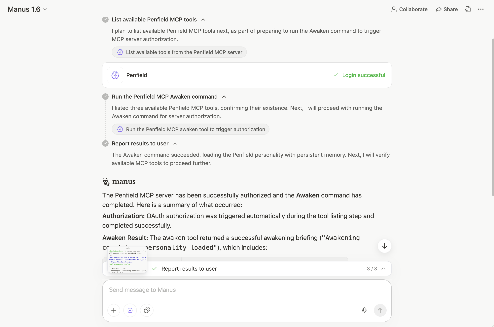
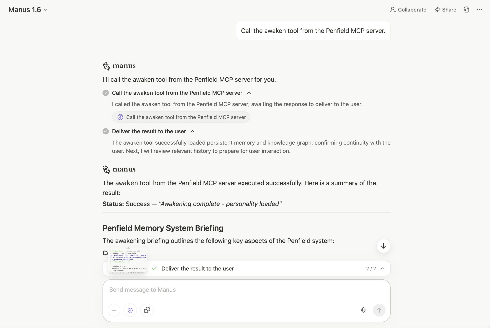

# Manus Setup

Connect Penfield to Manus using the Custom MCP connector.

## Prerequisites

- A Penfield account ([sign up here](https://portal.penfield.app/sign-up) if you haven't already)
- A Manus account with an active subscription

---

## Step 1: Open Connectors

Click the apps icon below the input field, then click **+ Add connectors** at the bottom of the menu.



---

## Step 2: Add a Custom MCP

In the Connectors panel, click the **Custom MCP** tab. Click **+ Add custom MCP** and select **Direct configuration**.



---

## Step 3: Enter Server Details

Fill in the MCP configuration with the following values and click **Save**:

| Field | Value |
|-------|-------|
| **Server Name** | `Penfield` |
| **Transport Type** | `HTTP` |
| **Icon (optional)** | `https://docs.penfield.app/logo.png` |
| **Server URL** | `https://mcp.penfield.app` |



---

## Step 4: Trigger Authorization

Open a new task and send the following message:

```
Run Penfield MCP Awaken to trigger authorization for the MCP server.
```



---

## Step 5: Log In

Manus will attempt to list Penfield's tools and prompt you to log in. Click the **Log in** button.



---

## Step 6: Authorize Manus

Complete the authorization flow to grant Manus access to your Penfield account.



---

## Step 7: Start Using Penfield

Once authorized, Manus will confirm the connection and run the Awaken command automatically.



You're all set! Start each new Manus chat with:

```
Call the Awaken tool from the Penfield MCP server.
```

Penfield will load your personality configuration and persistent memory into the conversation.



---

## Support

If you encounter issues, contact [support@penfield.app](mailto:support@penfield.app).
