# Setting Up Penfield with MCP-Remote

Penfield works with any AI platform that supports MCP (Model Context Protocol) via `mcp-remote`. This guide covers setup for popular platforms.

---

## Prerequisites

Most platforms require Node.js to run `mcp-remote`. If you don't have Node.js installed, download it from [nodejs.org](https://nodejs.org/).

---

## Configuration Reference

Most platforms use the same core configuration. Copy and adapt as needed:

```json
{
  "mcpServers": {
    "Penfield": {
      "command": "npx",
      "args": [
        "-y",
        "mcp-remote",
        "https://mcp.penfield.app/"
      ]
    }
  }
}
```

> **Note:** If you already have other MCP servers configured, add the `"Penfield": { ... }` block inside your existing `"mcpServers"` object. Don't create a second `"mcpServers"` key.

---

## Authorization

The first time you use Penfield in any application, a browser window will open asking you to authorize access. After authorizing once, other applications will share the same mcp-remote authorization automatically. If mcp-remote is upgrade, a new authorization may be required.

If authorization doesn't trigger automatically, try restarting the application after adding the configuration.

---

## Platform-Specific Instructions

- [Antigravity](#antigravity)
- [Perplexity](#perplexity)
- [Gemini CLI](#gemini-cli)
- [Windsurf](#windsurf)
- [Cursor](#cursor)
- [LM Studio](#lm-studio)
- [Other Platforms](#other-platforms)

---

## Antigravity

### Step 1: Open Agent Panel Menu

In the Agent panel on the right side of the screen, click the **three-dot menu** (**⋯**).

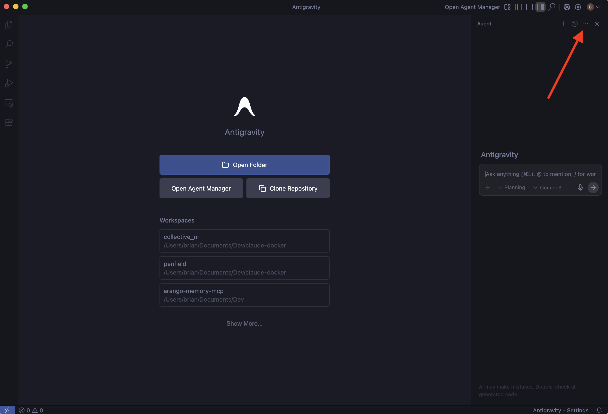

### Step 2: Open MCP Servers

From the dropdown menu, click **MCP Servers**.

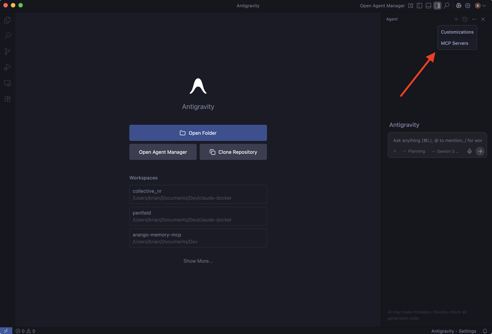

### Step 3: Open Manage MCP Servers

In the MCP Store panel, click **Manage MCP Servers** in the top right.

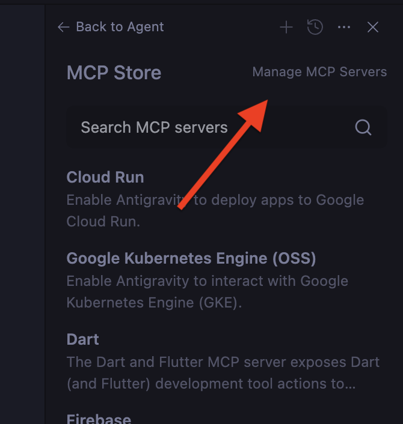

### Step 4: View Raw Config

Click **View raw config** to open the configuration file.

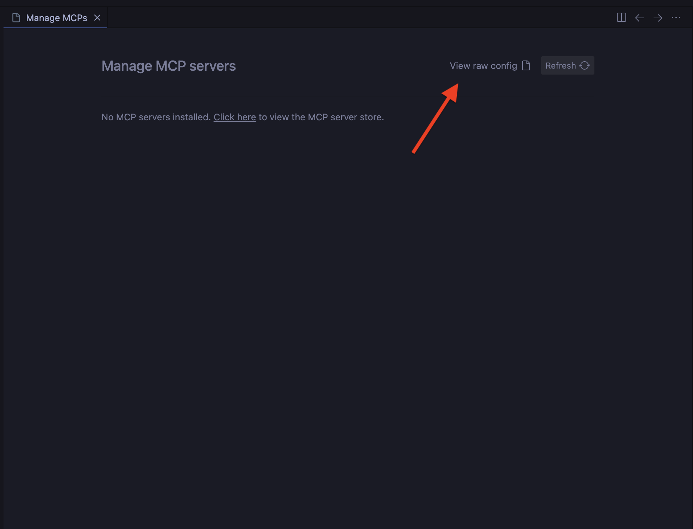

This opens `~/.gemini/antigravity/mcp_config.json` for editing.

### Step 5: Add Configuration

Add the Penfield configuration and save the file:

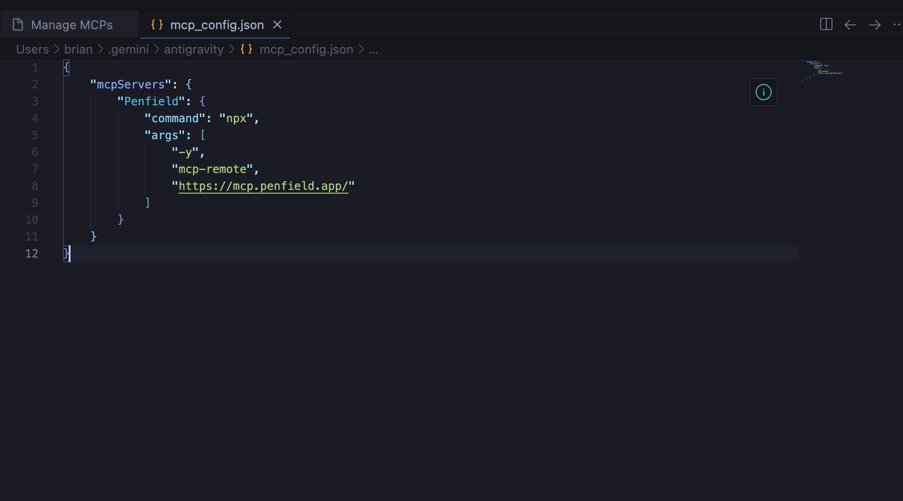

```json
{
  "mcpServers": {
    "Penfield": {
      "command": "npx",
      "args": [
        "-y",
        "mcp-remote",
        "https://mcp.penfield.app/"
      ]
    }
  }
}
```

### Step 6: Restart and Test

Restart Antigravity. If you haven't authorized Penfield previously, a browser tab will open automatically. Start a new chat and type "Awaken" to test the connection.

---

## Perplexity

Perplexity Desktop has a built-in connector interface that doesn't require editing JSON files directly.

### Step 1: Open Settings

Click the **Settings** icon in Perplexity Desktop, then click **Connectors**.

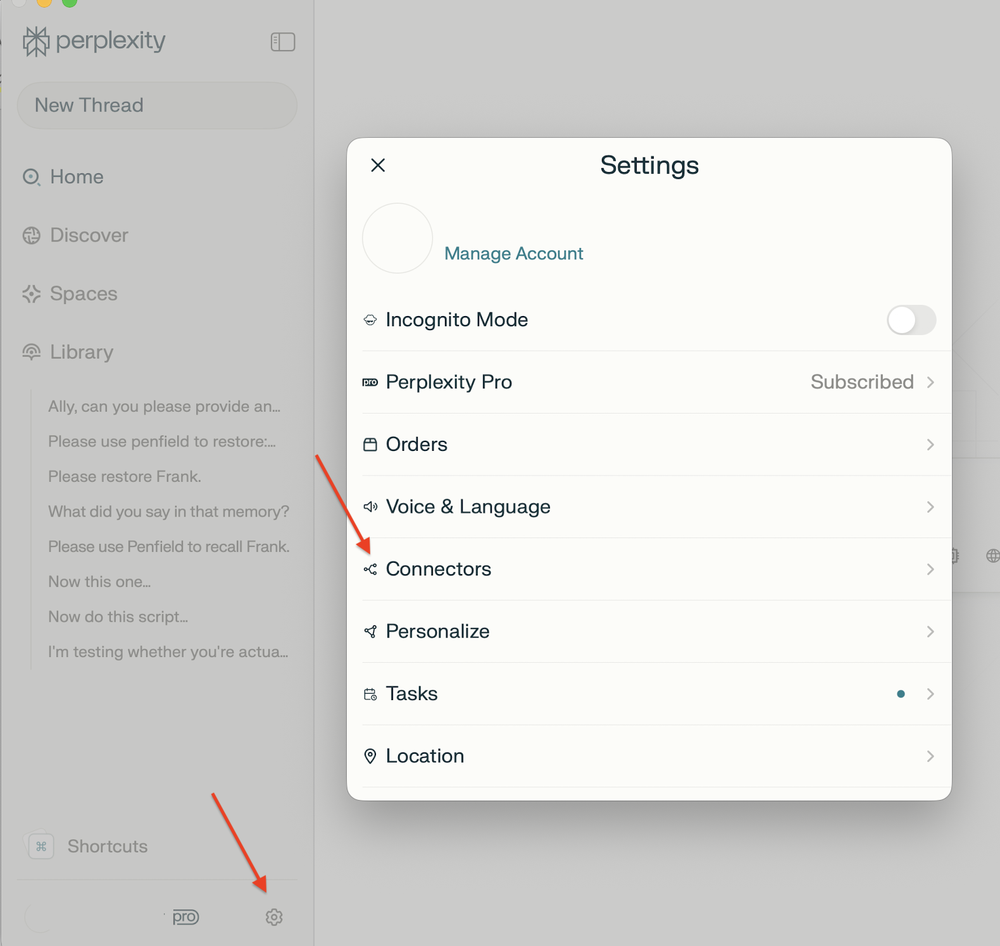

### Step 2: Add Connector

Click **Add Connector**.

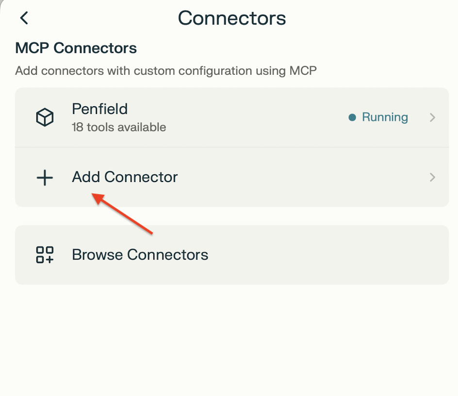

### Step 3: Configure (Simple View)

On the **Simple** tab, enter:

| Field | Value |
|-------|-------|
| **Server Name** | `Penfield` |
| **Command** | `npx -y mcp-remote https://mcp.penfield.app/` |

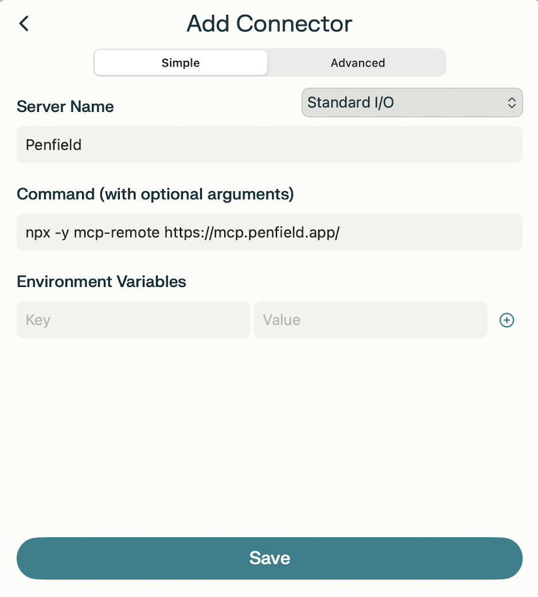

### Step 4: Verify Advanced Settings

Click the **Advanced** tab to confirm the JSON matches:

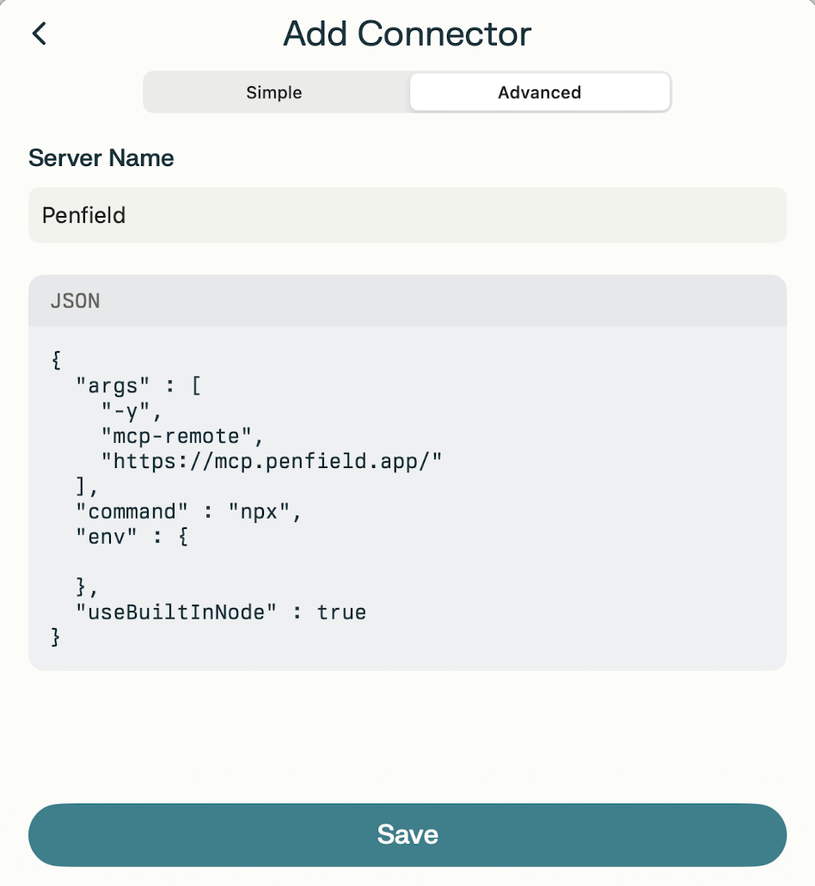

### Step 5: Save and Restart

Click **Save**, then restart Perplexity Desktop. If you haven't authorized Penfield previously, a browser window will open for authorization.

---

## Gemini CLI

### Step 1: Edit Settings File

Open `~/.gemini/settings.json` in your preferred editor:

```bash
nano ~/.gemini/settings.json
# or
code ~/.gemini/settings.json
```

### Step 2: Add Penfield Configuration

Add the Penfield configuration to your settings file. Your file structure may vary depending on your authentication method:

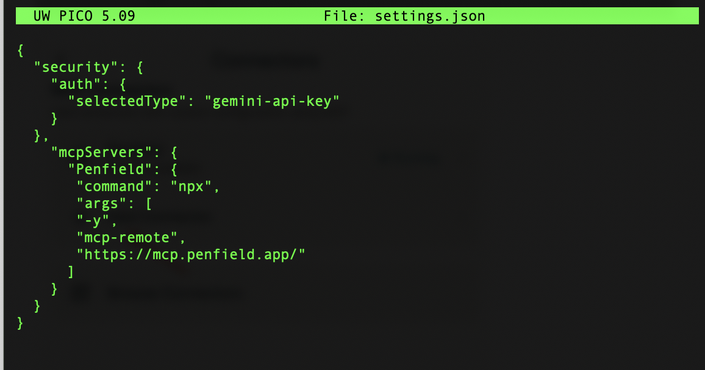

```json
{
  "mcpServers": {
    "Penfield": {
      "command": "npx",
      "args": [
        "-y",
        "mcp-remote",
        "https://mcp.penfield.app/"
      ]
    }
  }
}
```

### Step 3: Restart and Authorize

Run `gemini` again. If you haven't authorized Penfield previously, the authorization flow will open in your browser automatically. After authorizing, quit and restart Gemini CLI.

---

## Windsurf

### Step 1: Install mcp-remote

If you haven't already, install mcp-remote:

```bash
npm install -g mcp-remote
```

### Step 2: Open MCP Configuration

Click the **plug icon** (1), then click the **settings icon** (2) to open the configuration file.


This opens `~/.codeium/windsurf/mcp_config.json`. If this is your first MCP server, the file may be empty.

### Step 3: Add Configuration

Add the Penfield configuration:

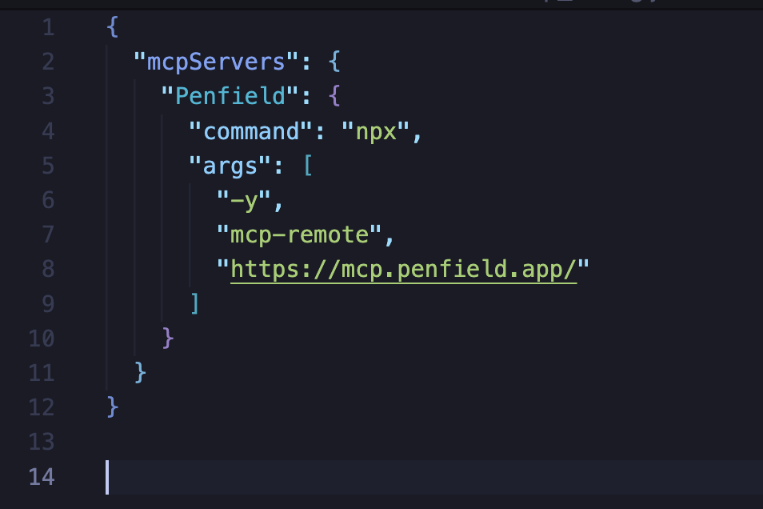

```json
{
  "mcpServers": {
    "Penfield": {
      "command": "npx",
      "args": [
        "-y",
        "mcp-remote",
        "https://mcp.penfield.app/"
      ]
    }
  }
}
```

### Step 4: Restart and Verify

Quit and restart Windsurf. If you haven't authorized Penfield previously, a browser tab will open automatically.

After authorization, click the plug icon to verify Penfield is connected with 18 tools available:

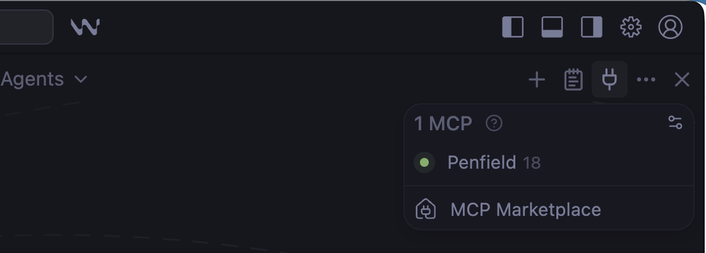

---

## Cursor

> **Known Issue:** Cursor's MCP authentication can be unreliable. If you experience problems, try authorizing Penfield in another application first (such as Windsurf, Gemini CLI, or LM Studio), then return to Cursor.

> **Note:** MCP tools may only be available in **Agent** mode, not in Ask or Plan modes.

### Step 1: Open MCP Settings

1. Click the **gear icon** to open settings
2. Click **Tools & MCP**
3. Click **Add Custom MCP**

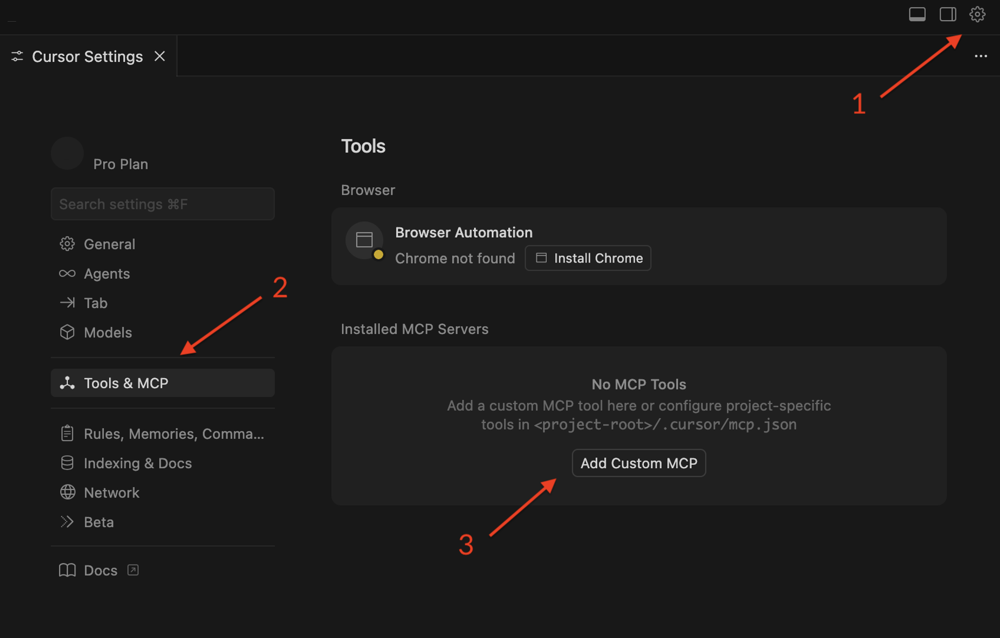

This opens `~/.cursor/mcp.json` for editing.

### Step 2: Add Configuration

Add the Penfield configuration:

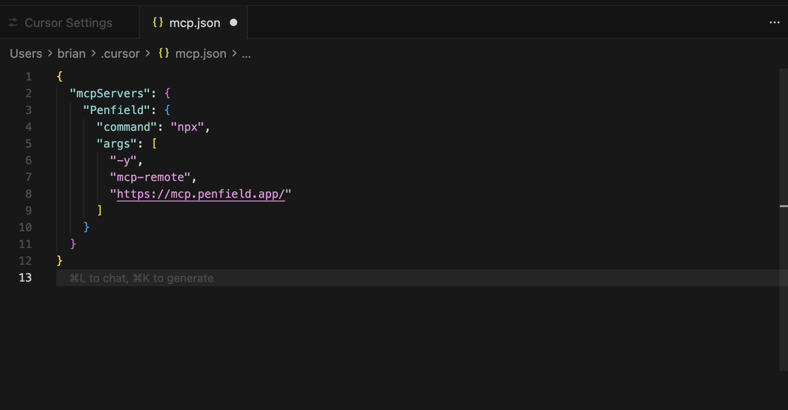

```json
{
  "mcpServers": {
    "Penfield": {
      "command": "npx",
      "args": [
        "-y",
        "mcp-remote",
        "https://mcp.penfield.app/"
      ]
    }
  }
}
```

### Step 3: Restart

Save the file and restart Cursor. If authorization doesn't trigger automatically, you may need to restart again after authorizing through another application.

---

## LM Studio

> **Important:** Local models have significant limitations compared to frontier models. See [LM Studio Notes](#lm-studio-notes) below.

### Step 1: Open MCP Configuration

Click the **Program** tab, click the **Install** dropdown, and select **Edit mcp.json**.

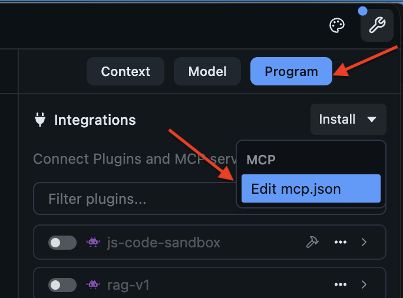

### Step 2: Add Configuration

Add the Penfield configuration and save the file:


```json
{
  "mcpServers": {
    "Penfield": {
      "command": "npx",
      "args": [
        "-y",
        "mcp-remote",
        "https://mcp.penfield.app/"
      ]
    }
  }
}
```

### Step 3: Restart and Load Model

Restart LM Studio and load your model. If you haven't authorized Penfield previously, a browser tab will open automatically.

### LM Studio Notes

**Model requirements:**

- Only models with explicit **tool use** support will work with Penfield
- Set **Context Length** to the maximum your hardware supports—MCP tool calls generate long contexts that can overflow smaller windows

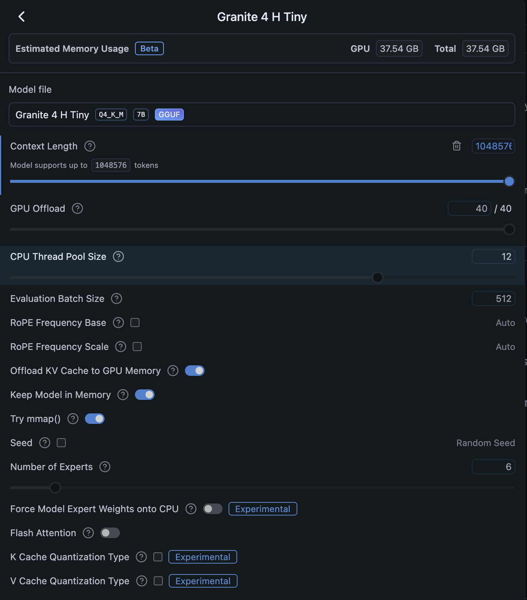

**Performance expectations:**

Local models typically have single or low double-digit billions of parameters, while frontier models operate in the hundreds of billions or trillions. Expect correspondingly different output quality.

**Recommended system prompt:**

```
You are my personal AI assistant and you will use Penfield to manage recalling and storing memories.
```

---

## Other Platforms

Any AI platform that supports `mcp-remote` can use Penfield. Add this configuration to your platform's MCP configuration file:

```json
{
  "mcpServers": {
    "Penfield": {
      "command": "npx",
      "args": [
        "-y",
        "mcp-remote",
        "https://mcp.penfield.app/"
      ]
    }
  }
}
```

Common configuration file locations:

| Platform | Configuration File |
|----------|-------------------|
| Antigravity | `~/.gemini/antigravity/mcp_config.json` |
| Windsurf | `~/.codeium/windsurf/mcp_config.json` |
| Cursor | `~/.cursor/mcp.json` |
| Gemini CLI | `~/.gemini/settings.json` |
| LM Studio | Via Program > Install > Edit mcp.json |

---

## Troubleshooting

**Authorization doesn't trigger:**
- Restart the application after adding the configuration
- Try authorizing through a different application first

**"Command not found" or npm errors:**
- Ensure Node.js is installed: `node --version`
- Try installing mcp-remote globally: `npm install -g mcp-remote`

**Tools not appearing:**
- Verify the JSON syntax is correct (no trailing commas, matching braces)
- Check that you're in the correct mode (e.g., Agent mode in Cursor)
- Restart the application

**Still having issues?**
Contact [support@penfield.app](mailto:support@penfield.app) for assistance.
