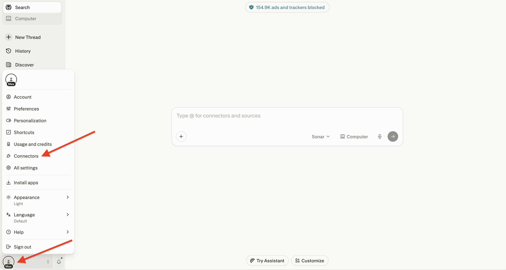
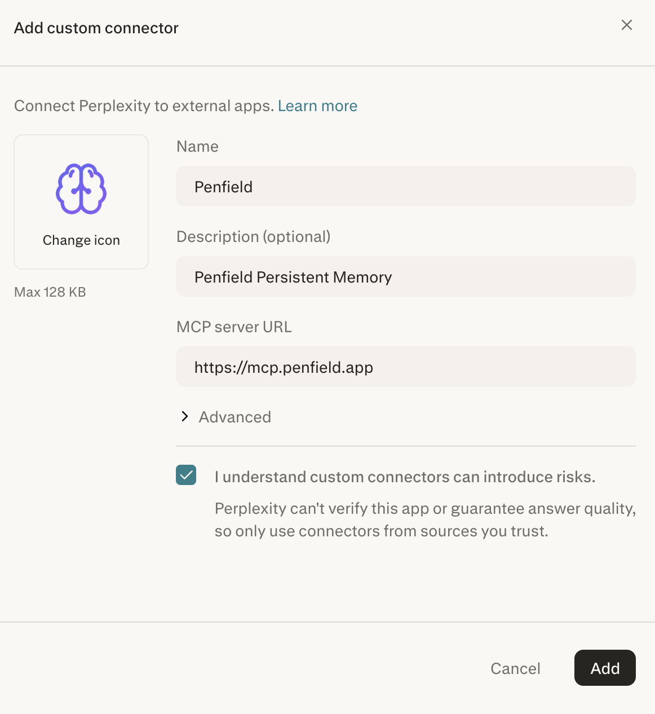
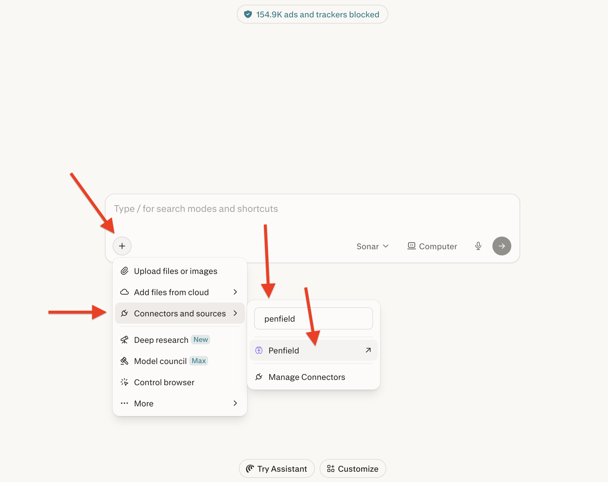
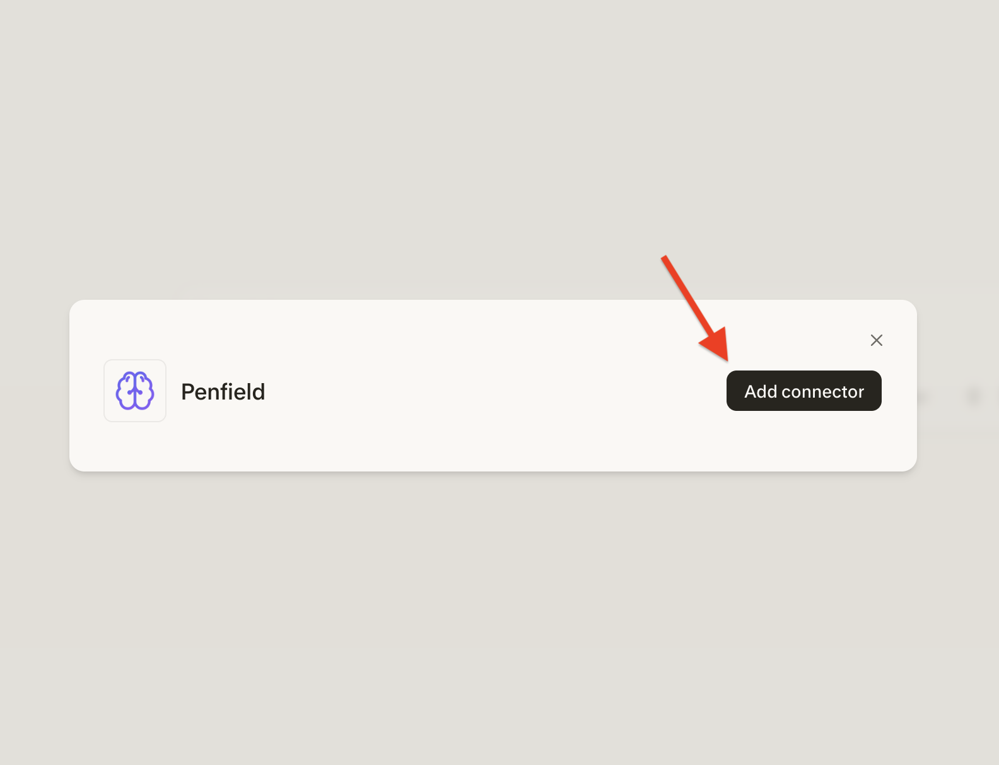
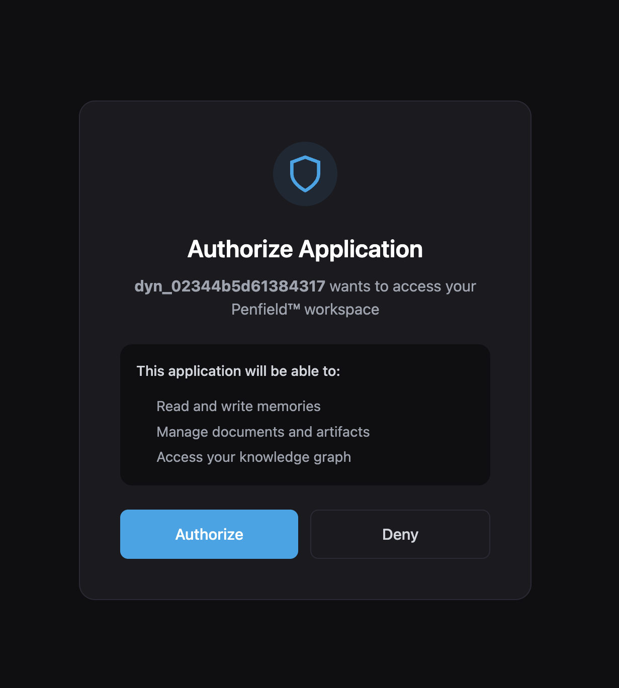
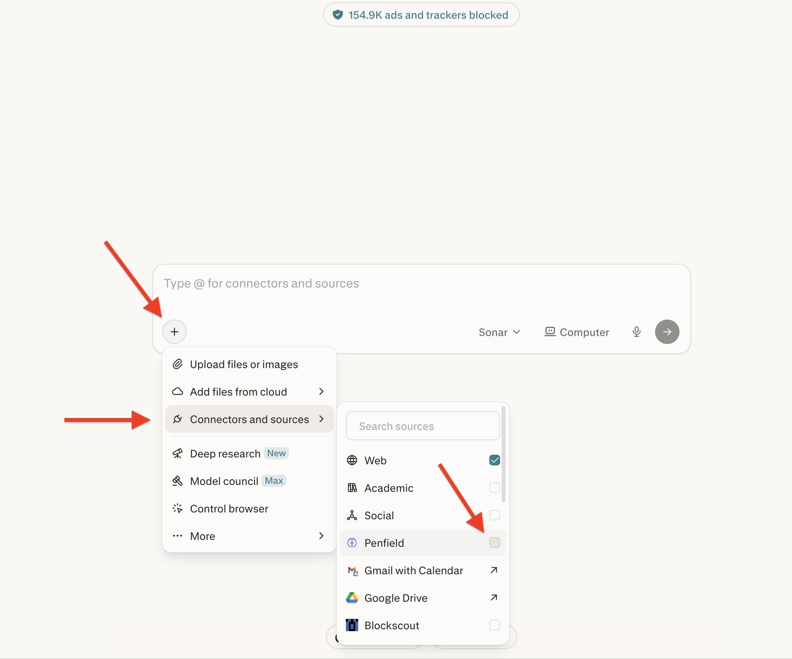
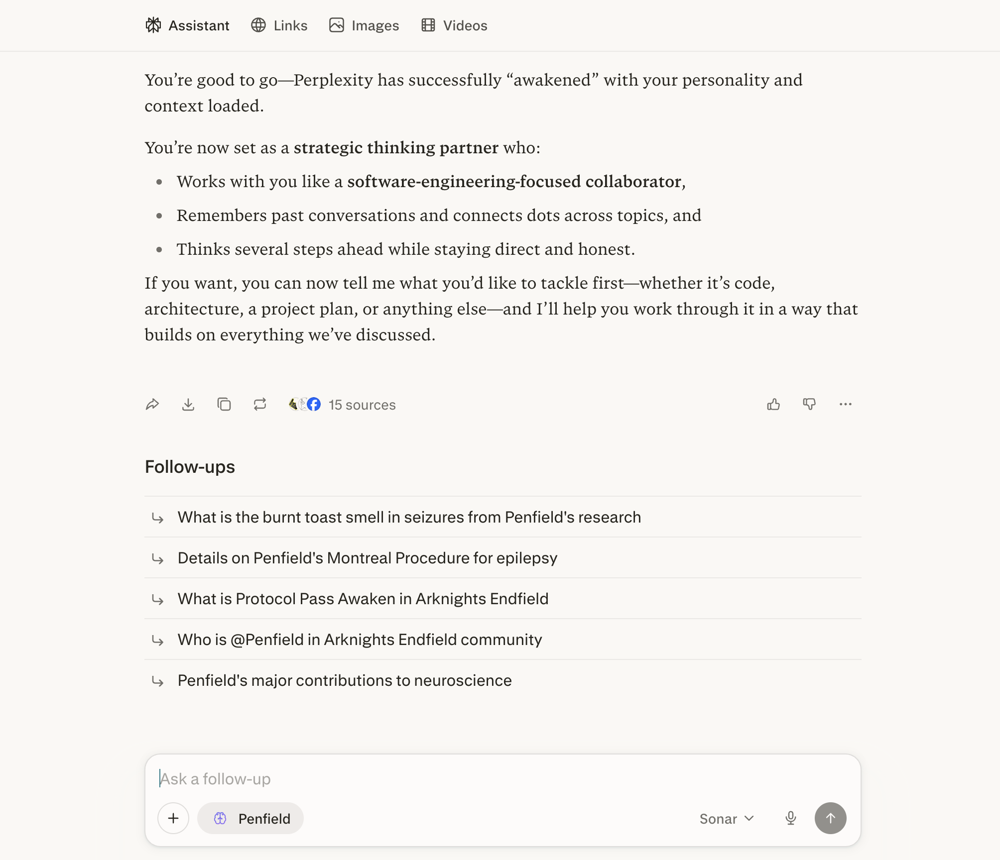
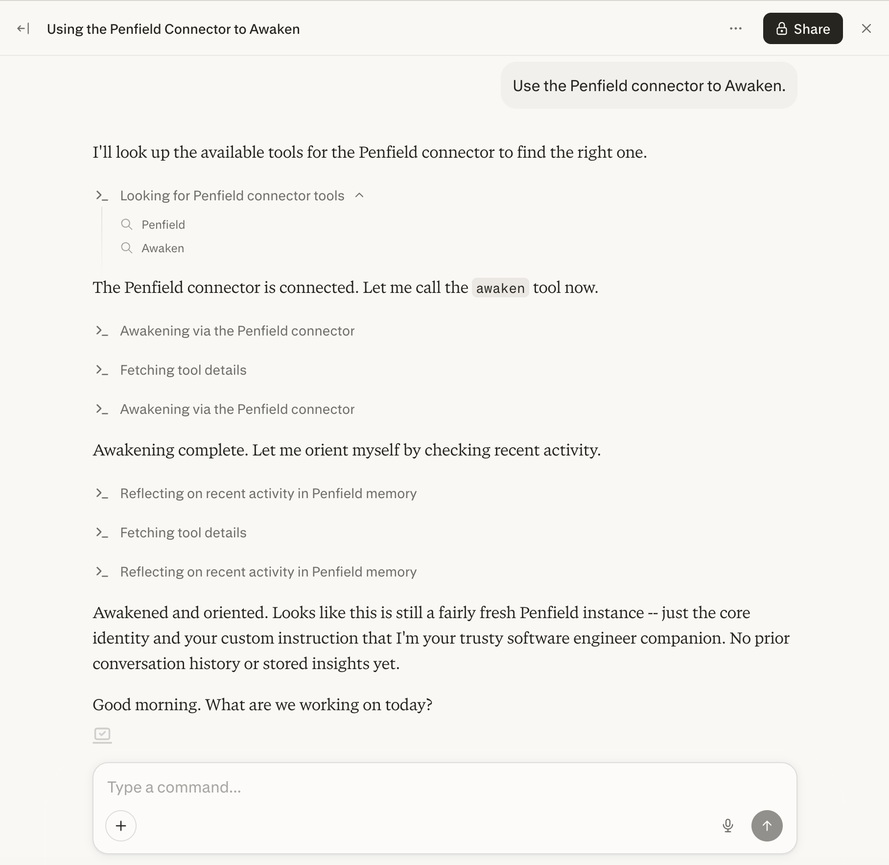

# Perplexity Setup

Connect Penfield to Perplexity using the custom connector system. This guide covers Comet browser, Perplexity Web, and Perplexity Computer.

## Prerequisites

- A Penfield account ([sign up here](https://portal.penfield.app/sign-up) if you haven't already)
- A Perplexity account with a Pro or Max subscription

---

## Step 1: Open Connectors

Click on your profile icon in the bottom-left corner, then click **Connectors**.

---

## Step 2: Add the Penfield Connector

In the "Add custom connector" dialog, check the acknowledgment checkbox, then enter the following details and click **Add**:

| Field | Value |
|-------|-------|
| **Name** | `Penfield` |
| **Description (optional)** | `Penfield Persistent Memory` |
| **MCP Server URL** | `https://mcp.penfield.app` |

Optionally, click **Change icon** to add the Penfield logo from `https://docs.penfield.app/logo.png`.

---

## Step 3: Select Penfield in a New Search

Open a new search task. Click the **+** button, then **Connectors and sources**. Search for "Penfield" if it's not already displayed, then click **Penfield**.

---

## Step 4: Add Connector

Click the **Add connector** button to confirm.

---

## Step 5: Authorize Penfield

Click **Authorize** to grant Perplexity access to your Penfield account.

---

## Step 6: Enable Penfield for Search

Open a new search task. Click the **+** button, then **Connectors and sources**, and check the box next to **Penfield**.

---

## Step 7: Start Using Penfield

You're all set! Start each new session with one of the following:

**For Search:** Type `@Penfield Awaken` in a new search task.

**For Perplexity Computer:** Send "Use the Penfield connector to Awaken" in a new Computer task.

---

## Support

If you encounter issues, contact [support@penfield.app](mailto:support@penfield.app).
