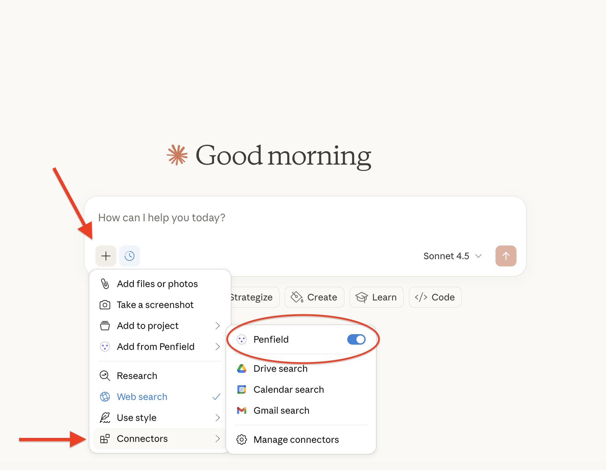
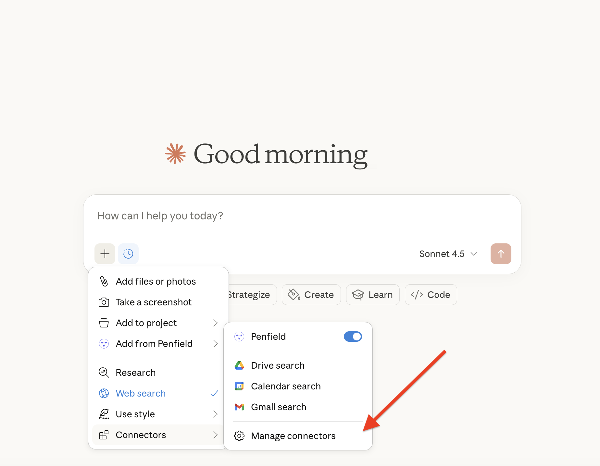
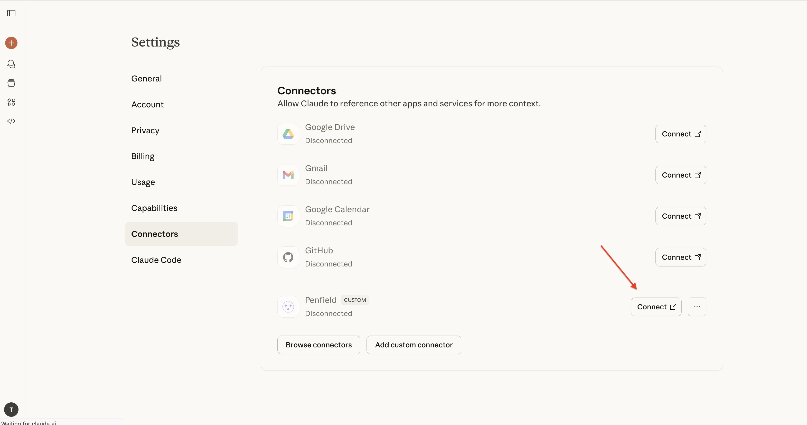
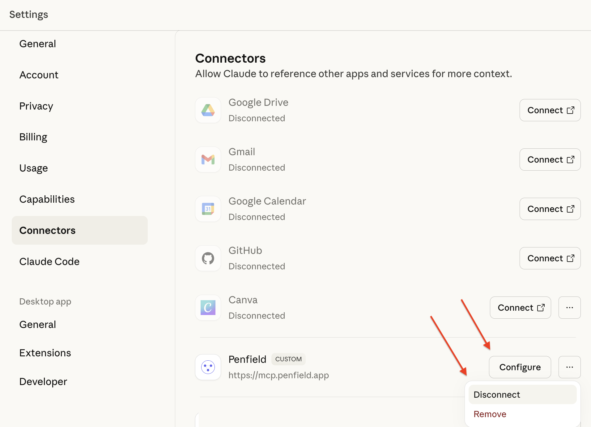
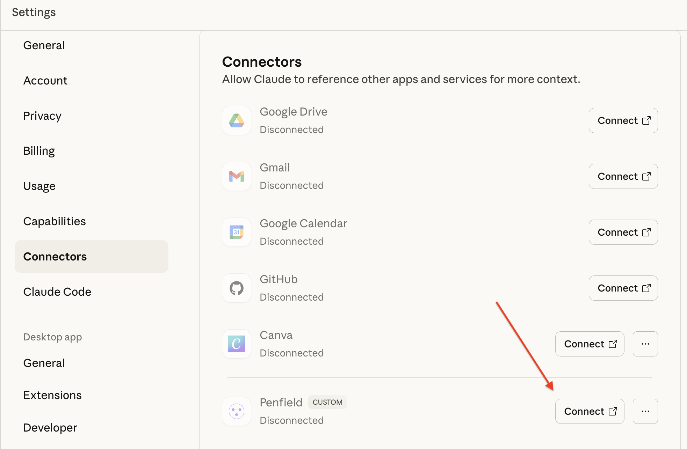
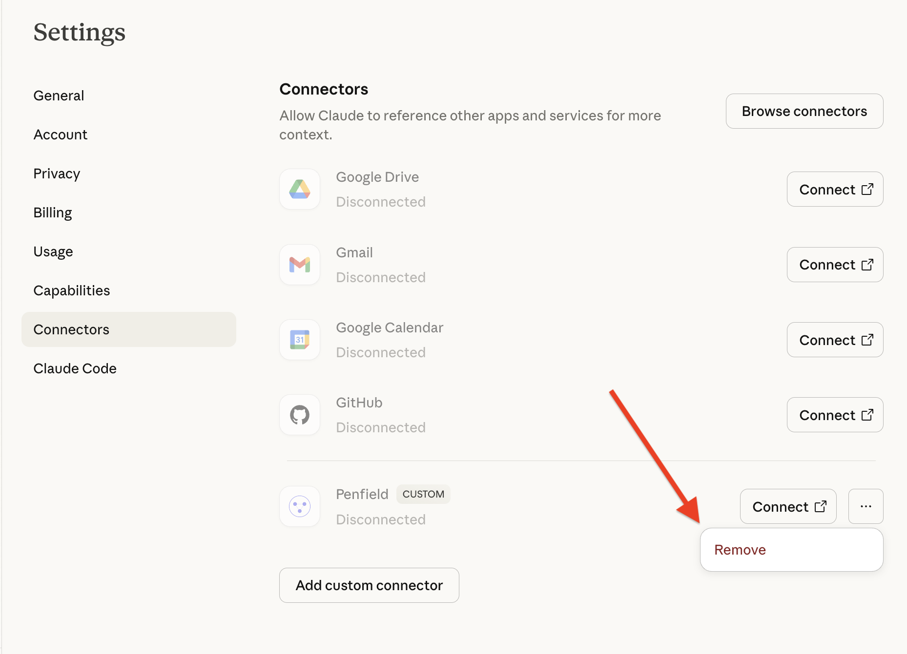
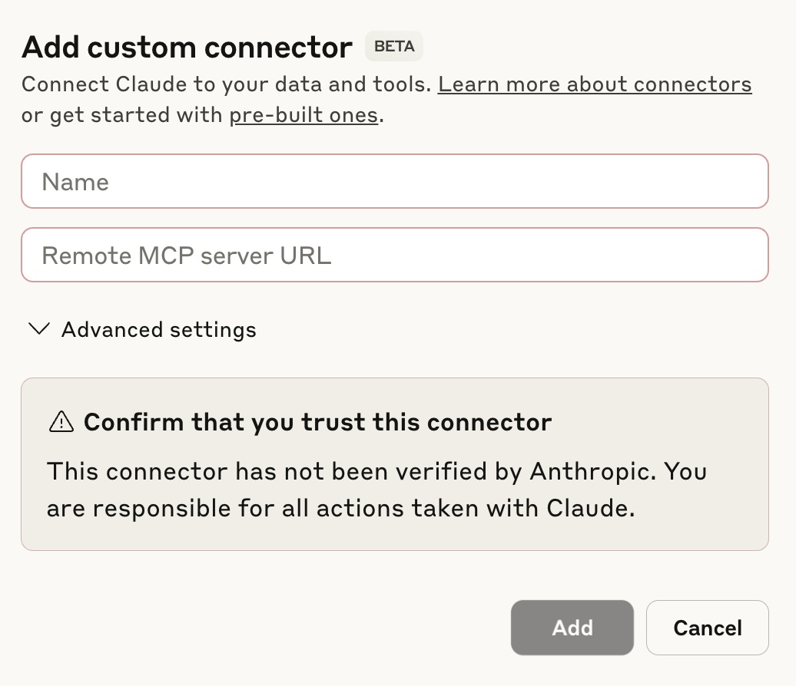

# Troubleshooting Penfield

Use this guide to diagnose and resolve connection issues with Penfield.

---

## Step 1: Verify Penfield Is Connected

Open the chat input menu in Claude and check that **Penfield** appears with the toggle enabled.

If Penfield appears and is enabled, your connection is working. Try typing "Awaken" in a new chat to test.

---

## Step 2: Reconnect via Manage Connectors

If Penfield is missing from the menu, shows as unavailable, is disabled but cannot be re-enabled or otherwise continues to malfunction, click **Manage connectors**.

In **Settings > Connectors**, locate Penfield, if Penfield is disconnected, click **Connect**.

When prompted, click **Authorize** to reconnect your Penfield account.

---

## Step 3: Disconnect and Reconnect

If Penfield appears connected but isn't functioning properly, try disconnecting and reconnecting:

1. Go to **Settings > Connectors**
2. Click the menu button (**⋯**) next to Penfield
3. Select **Disconnect**

4. After disconnecting, click **Connect** to re-establish the connection

---

## Step 4: Remove and Reinstall

If reconnecting doesn't resolve the issue, remove and reinstall the Penfield connector:

### Remove the existing connector

1. Go to **Settings > Connectors**
2. Click the menu button (**⋯**) next to Penfield
3. Select **Disconnect**
4. Select **Remove**

### Add the connector again

5. Click **Add custom connector**

6. In the dialog, enter the connector details:

| Field | Value |
|-------|-------|
| **Name** | `Penfield` |
| **Remote MCP server URL** | `https://mcp.penfield.app` |

7. Click **Add**

### Connect and authorize

8. Click **Connect** next to the newly added Penfield connector

9. Click **Authorize** to grant Penfield access to your workspace

---

## Still Having Issues?

Contact [support@penfield.app](mailto:support@penfield.app) for additional assistance.
